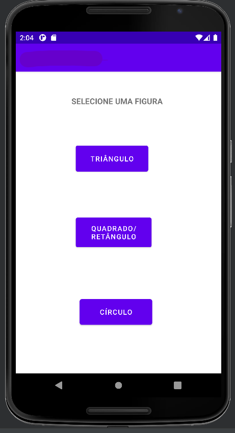
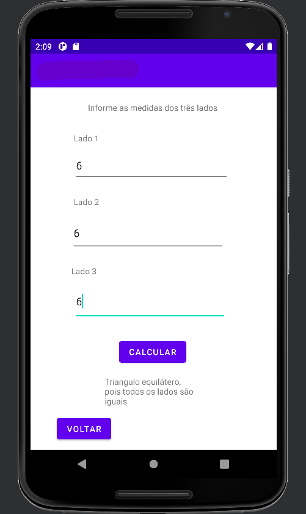
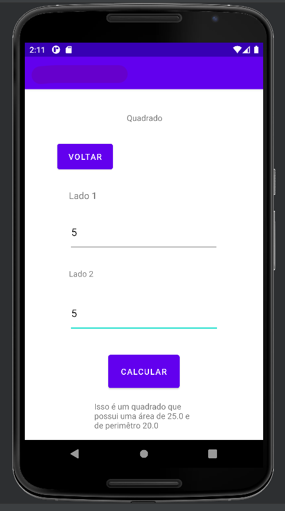
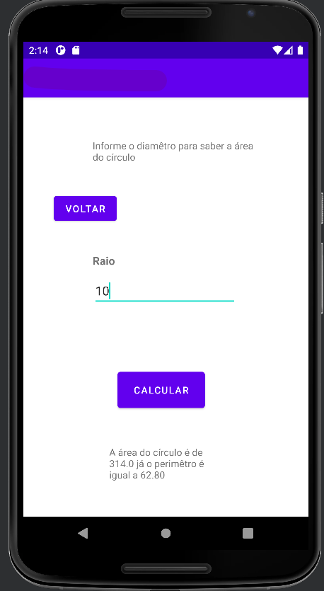

## Primeiro projeto mobile (java)

<h2>Cálculos para figuras geomêtricas.</h2>

Esse projeto foi proposto no curso técnico da ETEC de Embu, como forma parcial de menção trimestral. O objetivo do mesmo é trabalhar com a transição de telas e em cada uma delas realizar o cálculo das propriedades dessa figura, como área e perimêtro. O projeto usa o constraintlayout em sua estrutura e a versão do 7.5 do grandle.

<h2>Tela Inicial</h2>

 

<h2>Triângulo</h2>

 

<h2>Quadrado/Retângulo</h2>

 

<h2>Círculo</h2>

 
## 🛠️Tecnologias

* JAVA
* Android Studio

## 📞 Contato

📩E-mail: pedrohgs2004@gmail.com  
🌐Linkedin: https://www.linkedin.com/in/pedro-henrique-g-silva-a2100a22a/?originalSubdomain=br
